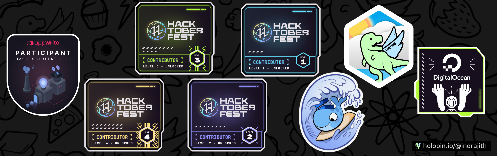

<h1 align="center">Hi 👋, I'm Indrajith Goswami</h1>
<h3 align="center">A passionate frontend developer from Bangladesh</h3>

<h2 align="left">Open source contribution | Hacktoberfest - 2022 🏆</h2>

  

  

<h2 align="left">Connect with me:</h2>

<h2 align="left">Languages and Tools:</h2>

              

